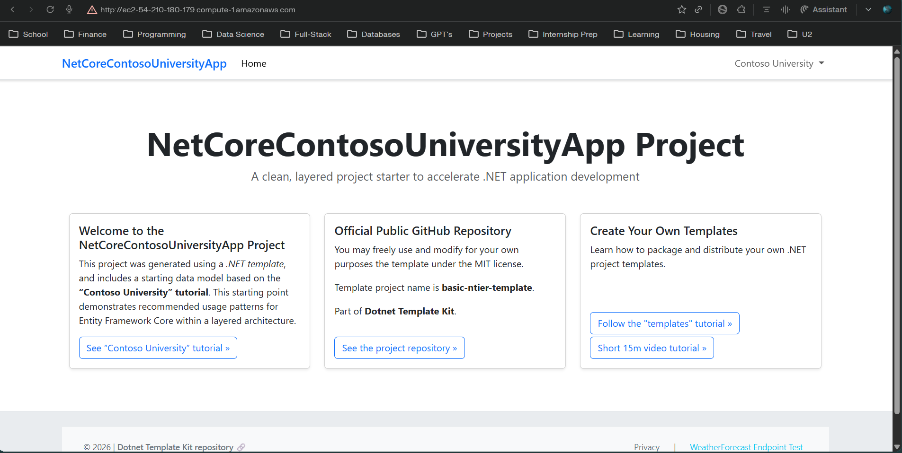
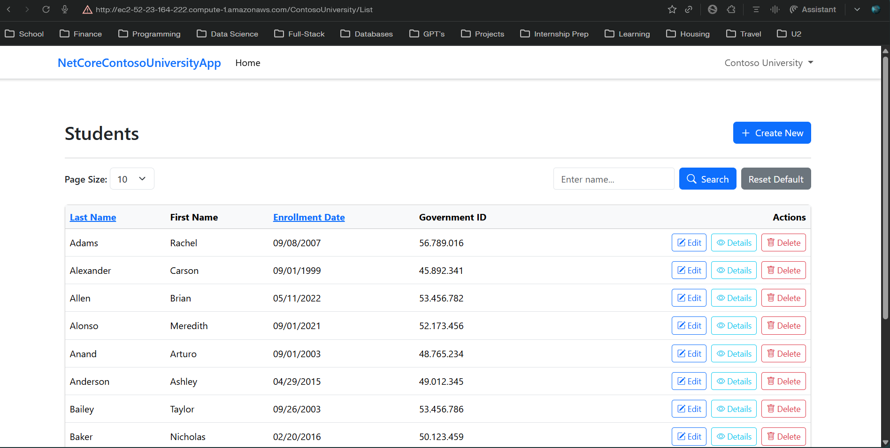

- [ITM 350 Final Project Report](#itm-350-final-project-report)
  - [Group A | Ethan Trent, Carlos Mercado | April 2026 |](#group-a--ethan-trent-carlos-mercado--april-2026-)
  - [1. Project Description](#1-project-description)
    - [What is the Project?](#what-is-the-project)
    - [Problem It Solves](#problem-it-solves)
  - [2. Live Application URL](#2-live-application-url)
  - [3. Screenshot of Application Running](#3-screenshot-of-application-running)
  - [4. Codebase URL](#4-codebase-url)
    - [Repository Structure](#repository-structure)
  - [5. Docker Hub Image URL](#5-docker-hub-image-url)
  - [6. Build Pipeline](#6-build-pipeline)
  - [7. Release Pipeline with Infrastructure as Code](#7-release-pipeline-with-infrastructure-as-code)
  - [8. Lessons Learned](#8-lessons-learned)
    - [1. Terraform State Management in CI/CD is Complex](#1-terraform-state-management-in-cicd-is-complex)
    - [2. EC2 user_data Only Runs Once at Launch](#2-ec2-user_data-only-runs-once-at-launch)
    - [3. Applications with Database Dependencies Need Sidecar Containers](#3-applications-with-database-dependencies-need-sidecar-containers)
    - [4. Branch Protection Requires Organization Admin Permissions](#4-branch-protection-requires-organization-admin-permissions)
    - [5. Automated Testing in CI Catches Regressions Early](#5-automated-testing-in-ci-catches-regressions-early)
    - [6. Infrastructure as Code Enables Reproducible Deployments](#6-infrastructure-as-code-enables-reproducible-deployments)
  - [Summary](#summary)

---

# ITM 350 Final Project Report

## Group A | Ethan Trent, Carlos Mercado | April 2026 |

---

## 1. Project Description

### What is the Project?

The **Contoso University** web application is a production-quality, open-source ASP\.NET Core MVC application built on .NET 10. It serves as a university student and course management system, enabling administrators to manage students, instructors, courses, and departments through a web-based interface backed by a relational SQL Server database.

### Problem It Solves

Universities face a real operational challenge: managing the enrollment lifecycle of students across multiple departments, courses, and instructors using disconnected spreadsheets or legacy systems. Contoso University solves this by providing a centralized, web-based platform where:

- **Students** can be enrolled, tracked, and graduated
- **Instructors** can be assigned to courses and departments
- **Courses** can be created, modified, and linked to departments
- **Departments** can be managed with budget and instructor assignments

The DevOps challenge this project solved was automating the full lifecycle from code commit to live production deployment on AWS — without ever requiring a developer to manually log into Docker Hub or AWS. Every code change automatically builds, tests, packages into a Docker image, and deploys the updated image to an EC2 instance using Terraform Infrastructure as Code.

---

## 2. Live Application URL

**EC2 Endpoint:** <http://ec2-52-23-164-222.compute-1.amazonaws.com>

The application is deployed to AWS EC2 (us-east-1) via automated Terraform provisioning triggered by the Release to AWS GitHub Actions pipeline. The application runs as two Docker containers:

- `mcr.microsoft.com/mssql/server:2022-latest` — SQL Server database
- `ethantrent/netcore-contoso-university:latest` — ASP.NET Core MVC web app

> **Note:** Because `user_data_replace_on_change = true` is set in Terraform, EC2 instances are replaced on each pipeline run and receive a new public DNS. The URL above reflects the most recent successful deployment.

---

## 3. Screenshot of Application Running

The application is successfully running and accessible. The screenshot below shows the Students management page with live seeded data loaded from the SQL Server database — confirming the full stack (web app + database + Docker networking) is operational.



**Application Pages Verified:**

- Home Page: <http://ec2-52-23-164-222.compute-1.amazonaws.com/>
- Students List: <http://ec2-52-23-164-222.compute-1.amazonaws.com/ContosoUniversity/List> (shows seeded student data)
- Navigation: Contoso University dropdown with Students, Statistics, About

The Students page successfully loads seeded data from the SQL Server database including student names, enrollment dates, and government IDs — confirming the full database connection is working.



**Build & Release Pipeline Proof:**

- Build Pipeline: <https://github.com/byui-devops/netcore-app-groupA-final/actions?query=workflow%3A%22Build%2C+Test+%26+Push%22>
- Release Pipeline: <https://github.com/byui-devops/netcore-app-groupA-final/actions?query=workflow%3A%22Release+to+AWS%22>

---

## 4. Codebase URL

**GitHub Repository:** <https://github.com/byui-devops/netcore-app-groupA-final>

### Repository Structure

```terminal
netcore-app-groupA-final/
├── .github/
│   └── workflows/
│       ├── build.yml     # CI: Build, test, push to Docker Hub
│       └── release.yml   # CD: Terraform deploy to AWS EC2
├── docs/
│   ├── app-screenshot.png              # Screenshot of running application
│   └── final-report.md                 # This report
├── src/
│   ├── NetCoreContosoUniversityApp.Web.MVC/                           # Main ASP.NET Core app
│   ├── NetCoreContosoUniversityApp.Data/                              # EF Core data layer
│   ├── NetCoreContosoUniversityApp.Repositories/                      # Repository pattern
│   ├── NetCoreContosoUniversityApp.Services/                          # Business logic layer
│   └── Testing/
│       ├── NetCoreContosoUniversityApp.Testing.Unit.Services/         # Unit tests (xUnit)
│       └── NetCoreContosoUniversityApp.Testing.Integration/           # Integration tests (5 HTTP route tests)
├── terraform/
│   ├── main.tf           # EC2 + security group + Docker IaC
│   ├── variables.tf      # Input variables
│   └── outputs.tf        # EC2 URL outputs
└── Dockerfile            # Multi-stage build
```

All changes to `main` were made through **feature branches and pull requests**:

- `feature/devops-pipeline` → PR #3 (Dockerfile, CI/CD, Terraform)
- `feature/integration-tests` → PR #4 (Integration test project, 5 HTTP tests)

---

## 5. Docker Hub Image URL

**Docker Hub:** <https://hub.docker.com/r/ethantrent/netcore-contoso-university>

The Docker image is automatically built and pushed to Docker Hub on every successful merge to `main`. The image is publicly accessible and tagged `latest`.

**Image:** `ethantrent/netcore-contoso-university:latest`

The Dockerfile uses a **multi-stage build**:

1. **Build stage** — Uses `mcr.microsoft.com/dotnet/sdk:10.0` to compile and publish the app
2. **Runtime stage** — Uses `mcr.microsoft.com/dotnet/aspnet:10.0` as a lightweight runtime image

---

## 6. Build Pipeline

**Workflow:** `.github/workflows/build.yml`  
**Trigger:** Push to any branch, or pull request targeting `main`

| Step                | Description                                                                  |
| ------------------- | ---------------------------------------------------------------------------- |
| Checkout            | Pulls source from GitHub                                                     |
| Setup .NET          | Configures .NET 10.0 SDK                                                     |
| Restore             | Runs `dotnet restore`                                                        |
| Build               | Compiles with `dotnet build`                                                 |
| Unit Tests          | Runs `NetCoreContosoUniversityApp.Testing.Unit.Services`                     |
| Integration Tests   | Runs 5 HTTP route tests in `NetCoreContosoUniversityApp.Testing.Integration` |
| Docker Build & Push | Builds image and pushes to Docker Hub (main branch only)                     |

---

## 7. Release Pipeline with Infrastructure as Code

**Workflow:** `.github/workflows/release.yml`  
**Trigger:** Automatically after Build pipeline succeeds on `main`

All AWS infrastructure is defined in the `terraform/` directory and provisioned automatically — **no manual AWS login required**.

| Step                           | Description                                                |
| ------------------------------ | ---------------------------------------------------------- |
| Configure AWS Credentials      | Uses GitHub Secrets (no login required)                    |
| Terraform Init                 | Initializes Terraform providers                            |
| Import existing security group | Idempotent: handles pre-existing SG                        |
| Terraform Plan                 | Computes required infrastructure changes                   |
| Terraform Apply                | Provisions EC2 + security group, runs Docker via user_data |

**Terraform Resources:**

- `aws_security_group` — Opens port 80 (HTTP) and 22 (SSH)
- `aws_instance` — t2.medium EC2, runs SQL Server + app containers from Docker Hub images on boot
- `user_data_replace_on_change = true` — Forces EC2 replacement on any configuration change

---

## 8. Lessons Learned

### 1. Terraform State Management in CI/CD is Complex

Running Terraform in a stateless CI environment (GitHub Actions) without a remote backend means state is never persisted between runs. This caused `InvalidGroup.Duplicate` errors when the security group already existed from a previous pipeline run. The fix was to use `terraform import` to bring existing resources into state before applying. Going forward, using an S3 backend for remote state would be the production-correct solution.

### 2. EC2 user_data Only Runs Once at Launch

AWS EC2 user_data scripts only execute on the first boot of an instance. When Terraform imported an existing EC2 instance and made no changes, the Docker container from user_data was never re-run. Adding `user_data_replace_on_change = true` to the Terraform resource forces Terraform to destroy and recreate the instance when user_data changes — ensuring a fresh, clean deployment every time.

### 3. Applications with Database Dependencies Need Sidecar Containers

The ASP.NET Core application required a SQL Server database to start. Without a database, the app threw an `InvalidOperationException` at startup and refused to serve any requests. The solution was to run two Docker containers — SQL Server and the app — on the same Docker network inside the EC2 instance, passing the connection string as an environment variable. This is the foundation of Docker Compose patterns in production.

### 4. Branch Protection Requires Organization Admin Permissions

Setting up branch protection rules (requiring pull requests before merging to `main`) requires organization admin privileges. As a repository contributor rather than org admin, this setting was not configurable through the UI. In a professional environment, requesting admin rights or working with the org owner to enable protection rules would be the first step in a DevOps engagement.

### 5. Automated Testing in CI Catches Regressions Early

Integrating both unit and integration tests directly into the build pipeline (running on every push and PR) provided immediate feedback when changes broke application routes. The 5 HTTP integration tests covering all major routes (`/`, `/Students`, `/Courses`, `/Departments`, `/Instructors`) gave confidence that the deployed Docker image served all expected endpoints before it was ever pushed to production.

### 6. Infrastructure as Code Enables Reproducible Deployments

Defining the entire AWS environment in Terraform (EC2 instance type, security group rules, AMI selection, Docker startup) meant the infrastructure could be recreated from scratch in any AWS account by simply updating secrets and re-running the pipeline. This is the core DevOps principle of treating infrastructure like software — versioned, reviewed, and automated.

---

## Summary

| Requirement                | Status      | Evidence                                                                 |
| -------------------------- | ----------- | ------------------------------------------------------------------------ |
| GitHub Repository          | ✅ Complete | <https://github.com/byui-devops/netcore-app-groupA-final>                |
| Unit Tests                 | ✅ Complete | `src/Testing/NetCoreContosoUniversityApp.Testing.Unit.Services/` — xUnit |
| Integration Tests (5)      | ✅ Complete | `src/Testing/NetCoreContosoUniversityApp.Testing.Integration/`           |
| Docker Image on Docker Hub | ✅ Complete | `ethantrent/netcore-contoso-university:latest`                           |
| Build Pipeline (CI)        | ✅ Complete | `.github/workflows/build.yml` — 19+ runs                                 |
| Release Pipeline (CD)      | ✅ Complete | `.github/workflows/release.yml` — auto-triggered                         |
| IaC in Release Pipeline    | ✅ Complete | Terraform provisions EC2 + SG on AWS                                     |
| No Manual AWS Login        | ✅ Complete | All credentials stored as GitHub Secrets                                 |
| Feature Branches & PRs     | ✅ Complete | PR #3 and PR #4 merged to main                                           |
| Application Running on EC2 | ✅ Complete | <http://ec2-52-23-164-222.compute-1.amazonaws.com>                       |
| App Screenshot             | ✅ Complete | `docs/app-screenshot.png`                                                |
| Final Report               | ✅ Complete | This document                                                            |
