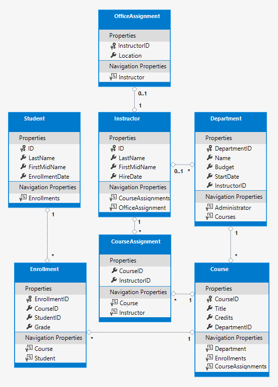

- [Basic Ntier Template](#basic-ntier-template)
  - [Version compatibility](#version-compatibility)
    - [Table: .NET Core](#table-net-core)
    - [Table: Identity API](#table-identity-api)
    - [Table: MVC](#table-mvc)
    - [Table: Angular](#table-angular)
  - [Content](#content)
    - [`Contoso University` Tutorial Example](#contoso-university-tutorial-example)

---

> THE CONTENT ON THIS FOLDER WAS GENERATED USING A DOTNET TEMPLATE
>
> Some projects mentioned in this README file may be missing.

| #   | STATUS                                                                |
| --- | --------------------------------------------------------------------- |
| 1   | This is a **UNDER DEVELOPMENT** .NET Core 10 and Angular 20 solution. |
| 2   | You can find previous functional versions in the repository branches. |

---

# Basic Ntier Template

<https://github.com/carloswm85/basic-ntier-template>

---

## Version compatibility

### Table: .NET Core

| Current | .NET Core | .NET Core release type        | EF Core  | Status            |
| ------- | --------- | ----------------------------- | -------- | ----------------- |
| ✅      | `10`      | LTS (ends: November 14, 2028) | -        | Under development |
|         | `9`       | STS (ends: November 10, 2026) | -        | Skipped           |
|         | `8.0.100` | LTS (ends: November 10, 2026) | `8.0.22` | Fully functional  |

[.NET and .NET Core Support Policy](https://dotnet.microsoft.com/en-us/platform/support/policy/dotnet-core) ↗

### Table: Identity API

| Current | Identity API (compatible with this EF Core) | Status      |
| ------- | ------------------------------------------- | ----------- |
| ❌      | `8.0.21`                                    | Unsupported |

[Official Documentation on Identity API](https://learn.microsoft.com/en-us/aspnet/core/security/authentication/identity?view=aspnetcore-8.0&tabs=visual-studio) ↗

### Table: MVC

| Current | Bootstrap | jQuery  | jQuery Validate | Jquery Validation Unobtrusive | Status           |
| ------- | --------- | ------- | --------------- | ----------------------------- | ---------------- |
| ✅      | `5.3.8`   | `3.7.1` | `1.21.0`        | `4.0.0`                       | Fully functional |

- Used `libman.json` for client side libraries.
- Bootstrap `+5.x` does not depend on `jQuery`.

### Table: Angular

| Current | Angular Version      | Angular Release Type   | Node.js Version                       | TypeScript Version | RxJS Version         | Status                                   |
| ------- | -------------------- | ---------------------- | ------------------------------------- | ------------------ | -------------------- | ---------------------------------------- |
| ✅      | `20.2.x` or `20.3.x` | LTS (ends: 2026-11-28) | `^20.19.0` or `^22.12.0` or `^24.0.0` | `>=5.9.0 <6.0.0`   | `^6.5.3` or `^7.4.0` | Under development                        |
|         | `19.2.x`             | LTS (ends: 2026-05-19) | `^18.19.1` or `^20.11.1` or `^22.0.0` | `>=5.5.0 <5.9.0`   | `^6.5.3` or `^7.4.0` | Only with basic development setup added. |
|         | `18.1.x` or `18.2.x` | Out of support         | `^18.19.1` or `^20.11.1` or `^22.0.0` | `>=5.4.0 <5.6.0`   | `^6.5.3` or `^7.4.0` | Not available                            |

---

## Content

- Section 1:
  - [Solution Artchitecture](./content/architecture.md)
  - [Template Installation and Use](./content/template-use.md)
  - [Troubleshooting](./content/troubleshooting.md)
- Section 2:
  - [Development Set-Up](./content/development-setup.md)
  - Dependencies:
    - [NET Core](./content/dependencies-net-core.md)
      - [Identity API](./content/identity-api.md)
    - [Angular](./content/dependencies-angular.md)
- Section 3:
  - [Education](./content/education.md)

---

### `Contoso University` Tutorial Example

- This template has a built in example case for use and testing of database, EF Core, API endpoints and MVC frontend.
- The example is partially completed.
- For additional information on this example, see the official tutorial: <https://learn.microsoft.com/en-us/aspnet/core/data/ef-mvc/?view=aspnetcore-8.0>

