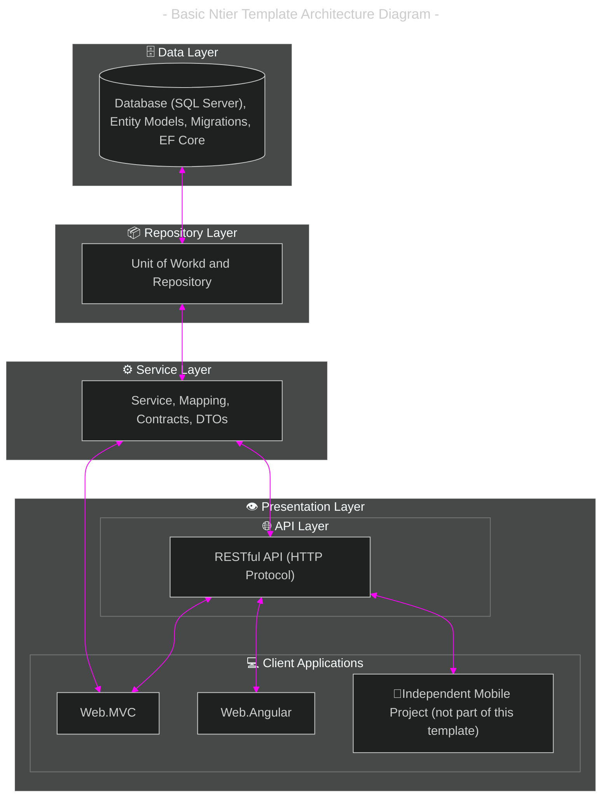

- [Solution Architecture](#solution-architecture)
	- [Table: Architecture Layers](#table-architecture-layers)
	- [Cross-Cutting Concerns For All Layers](#cross-cutting-concerns-for-all-layers)
	- [Clean Architecture Layer Breakdown (Different Than Template Variant)](#clean-architecture-layer-breakdown-different-than-template-variant)
		- [Key Mapping Notes: CA Vs N-Tier](#key-mapping-notes-ca-vs-n-tier)
	- [Diagram: N-Tier Architecture](#diagram-n-tier-architecture)
	- [Notes](#notes)

---

# Solution Architecture

## Table: Architecture Layers

| Level | Layers        | Classification                     | Role                                                                             | Functionality                                                              | Technology/Notes                                                                           | Dependencies       | Clean Architecture Equivalence (_approximate_)                                              |
| ----- | ------------- | ---------------------------------- | -------------------------------------------------------------------------------- | -------------------------------------------------------------------------- | ------------------------------------------------------------------------------------------ | ------------------ | ------------------------------------------------------------------------------------------- |
| 1     | `Data`        | -                                  | Define database schema, manage migrations, and entity mapping.                   | Database schema, migrations, models, database seeding data                 | Entity Framework Core, Identity API, SQL Server/PostgreSQL                                 | `None`             | **Infrastructure Layer** (Persistence)                                                      |
| 2     | `Repository`  | -                                  | Abstract data access logic to decouple the service layer from EF Core specifics. | Data access abstraction, caching, Unit of Work Pattern, Repository Pattern | IUserRepository, IProductRepository, Redis/In-Memory Cache                                 | `Data`             | **Infrastructure Layer** (Implementations) / **Application Layer** (Interfaces)             |
| 3     | `Service`     | Business logic                     | Implement business logic, enforce rules and validation.                          | Business logic, validation, orchestration                                  | FluentValidation, async/await patterns, domain services                                    | `Repository`       | **Application Layer** (Use Cases/Application Services) + **Domain Layer** (Domain Services) |
| 4.a   | `API`         | Request handling, Dev presentation | Expose business services as RESTful endpoints.                                   | RESTful API, documentation, API interface                                  | ASP\.NET Core Web API, Swagger/OpenAPI, API versioning, JWT authentication                 | `Service`          | **Presentation Layer** (API Controllers/Endpoints)                                          |
| 4.b   | `Web.MVC`     | User presentation                  | Traditional server-rendered UI using MVC and Razor Pages.                        | Server-side rendering, UI logic, form handling                             | ASP\.NET Core MVC, Razor Pages, ViewModels, Tag Helpers                                    | `Service` or `API` | **Presentation Layer** (MVC Controllers/Views)                                              |
| 4.c   | `Web.Angular` | User presentation                  | Modern client-side SPA experience.                                               | Client-side SPA, dynamic UI, state management                              | Angular (TypeScript), RxJS, HttpClient, REST API integration, Component-based architecture | `API`              | **Presentation Layer** (UI Components)                                                      |

## Cross-Cutting Concerns For All Layers

These span multiple layers:

- **Logging**: Serilog, NLog (all layers)
- **Authentication/Authorization**: ASP\.NET Core Identity, JWT (API, Web.MVC, Web.Angular)
- **Error Handling**: Global exception filters, middleware (API, Web.MVC)
- **Dependency Injection**: Built-in ASP\.NET Core DI container (all layers)

## Clean Architecture Layer Breakdown (Different Than Template Variant)

**Clean Architecture follows the Dependency Rule: dependencies point inward, toward the Domain.**

`NetCoreContosoUniversityApp` is a Clean Architecture variant. For better understanding, we'll highlight here the similarities between the two.

1. **Domain Layer (Core)** - Innermost layer, no dependencies

   - Enterprise business rules
   - Domain entities and value objects
   - Domain services (part of `Service` layer)
   - Domain events

2. **Application Layer** - Depends only on Domain

   - Application business rules
   - Use cases / Application services (part of `Service` layer)
   - Repository interfaces (defined here, implemented in Infrastructure)
   - DTOs, validators, orchestration logic

3. **Infrastructure Layer** - Depends on Application & Domain

   - External concerns: database, file system, web services
   - Equivalent to `Data` layer (EF Core, migrations, DbContext)
   - Equivalent to `Repository` implementations
   - Caching, logging, email services
   - Third-party integrations

4. **Presentation Layer** - Depends on Application
   - User interface concerns
   - Equivalent to `API`, `Web.MVC`, and `Web.Angular` layers
   - Controllers, views, API endpoints
   - Input validation, authentication/authorization middleware
   - Presentation models (ViewModels, DTOs for API responses)

### Key Mapping Notes: CA Vs N-Tier

- **`Service` layer spans two Clean Architecture layers**: Domain services belong to the Domain Layer, while application services (use cases) belong to the Application Layer.
- **Repository pattern spans layers**: Interfaces are defined in the Application Layer, but implementations live in the Infrastructure Layer.
- **Ntier Architecture is practical**: While Clean Architecture is more granular with 4 distinct layers, a 4-tier(ish) approach (`Data`/`Repository`/`Service`/`Presentation(API and Web)`) is a pragmatic implementation that achieves similar goals with less complexity for many applications.

## Diagram: N-Tier Architecture

_Diagram made using [mermaid.js](https://mermaid.js.org/)_

## Notes

- Data Layer:
  - Etity Framework Core, with code-first and database-first support.
- Repository:
  - Define interfaces for repositories (e.g., IUserRepository) which support CRUD and query operations asynchronously.
  - Caching: Caching strategies, or as a decorator pattern, to optimize repeated data retrieval.
  - Unit of Work Pattern: Aggregate repository transactions ensuring atomicity.
