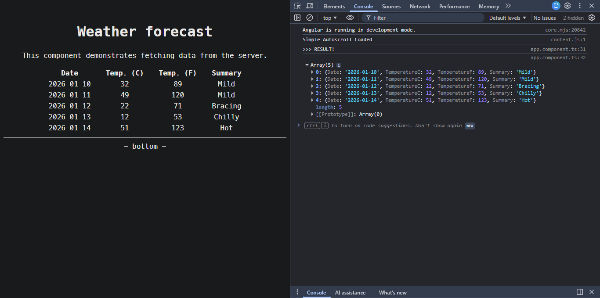

- [Development Set-Up](#development-set-up)
  - [NET Core Development](#net-core-development)
  - [Angular Development (installation and upgrade)](#angular-development-installation-and-upgrade)
    - [Install Node](#install-node)
    - [Install Angular](#install-angular)
      - [Upgrade Angular Project](#upgrade-angular-project)
    - [Run the Application](#run-the-application)
      - [(a) Running SPA in ASP.NET Core (Together)](#a-running-spa-in-aspnet-core-together)
      - [(b) Running SPA and ASP.NET Core Separately](#b-running-spa-and-aspnet-core-separately)

---

# Development Set-Up

## NET Core Development

- <https://dotnet.microsoft.com/en-us/download/dotnet>

Specific NET Core version installation:

- In Windows:

  ```powershell
  winget install Microsoft.DotNet.SDK.10
  ```

For running EF Core migrations correctly, get the correct tool versions:

```powershell
> dotnet tool uninstall --global dotnet-ef
> dotnet tool install --global dotnet-ef
```

Add correct packages:

```powershell
dotnet add package Microsoft.EntityFrameworkCore.SqlServer
dotnet add package Microsoft.EntityFrameworkCore.Tools
dotnet add package Microsoft.EntityFrameworkCore.Design
```

---

## Angular Development (installation and upgrade)

### Install Node

- Install: <https://nodejs.org/en/download>
- Or better:
  - In Mac/Linux: <https://github.com/nvm-sh/nvm>
  - In Windows: <https://github.com/coreybutler/nvm-windows/>
    - Usage:

      ```powershell
      > nvm list
      > nvm install lts
      > nvm install 19
      > nvm use 19
      ```

You can install multiple Node versions.

### Install Angular

Commands:

```powershell
> npm install -g @angular/cli@19.2.0
> ng version
> ng serve
```

#### Upgrade Angular Project

```powershell
> nvm list
> nvm use 22.20.0 # select target Node version
> npm uninstall -g @angular/cli
> npm install -g @angular/cli@20.2.0
> ng version
> node -v
> npx ng update @angular/core@20.2.0 @angular/cli@20.2.0
> Remove-Item node_modules -Recurse -Force
> npm install
```

### Run the Application

For Angular development you have 2 options:

1. Run both projects together from ASP.NET Core.
2. Run the `NetCoreContosoUniversityApp.Web.API` project separately from the `NetCoreContosoUniversityApp.Web.Angular` poject.

#### (a) Running SPA in ASP.NET Core (Together)

1. Install the dependency:

```powershell
dotnet add package Microsoft.AspNetCore.SpaProxy
```

2. At `NetCoreContosoUniversityApp.Web.API\Properties\launchSettings.json`, uncomment lines:

```json
"ASPNETCORE_HOSTINGSTARTUPASSEMBLIES": "Microsoft.AspNetCore.SpaProxy"
```

3. At `NetCoreContosoUniversityApp.Web.API\NetCoreContosoUniversityApp.Web.API.csproj` uncomment:

```xml
<!-- Angular Project
-->
<SpaProxyLaunchCommand>npm start</SpaProxyLaunchCommand>
<SpaRoot>..\NetCoreContosoUniversityApp.Web.Angular</SpaRoot>
<SpaProxyServerUrl>https://localhost:5021</SpaProxyServerUrl>
```

4. When debugging `NetCoreContosoUniversityApp.Web.API`, the Angular SPA will be launched (`NetCoreContosoUniversityApp.Web.Angular`).

Working demo page, fetching data from API layer to Angular layer:



#### (b) Running SPA and ASP.NET Core Separately

- Run `NetCoreContosoUniversityApp.Web.API` without following the previous steps.
- Run the Angular app from its root folder using `ng serve` using your favorite IDE or editor.
